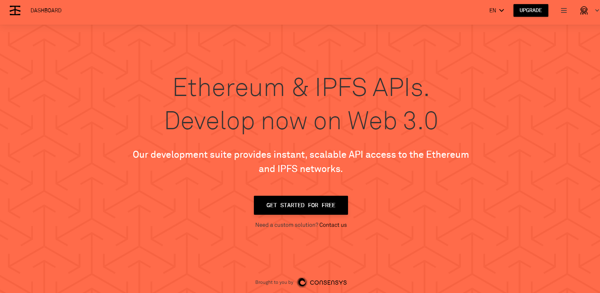
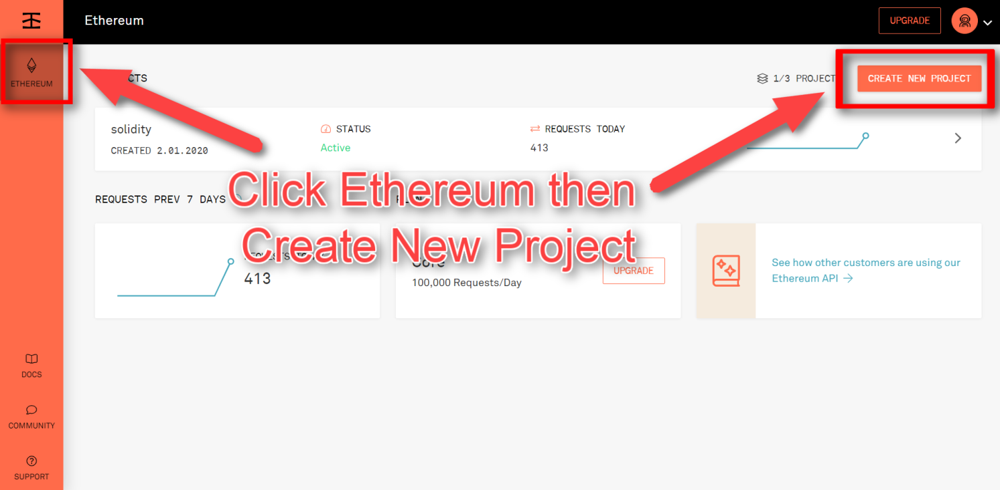
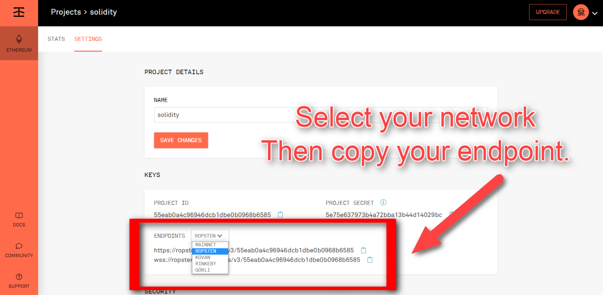
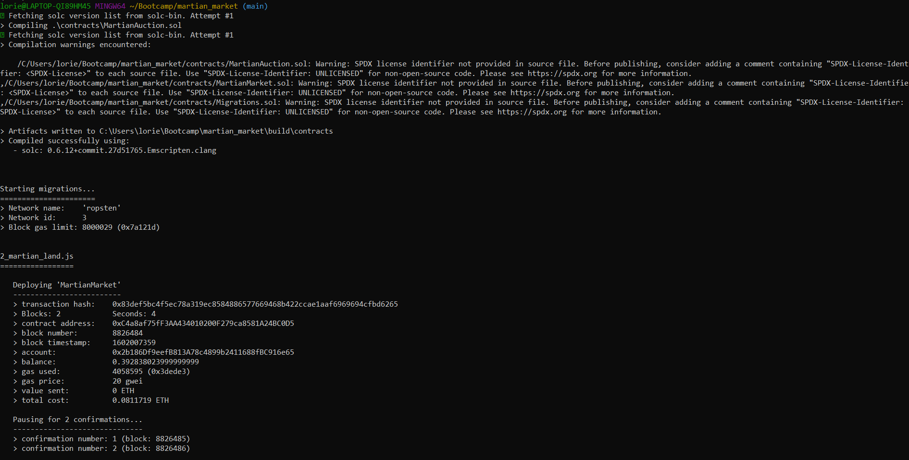
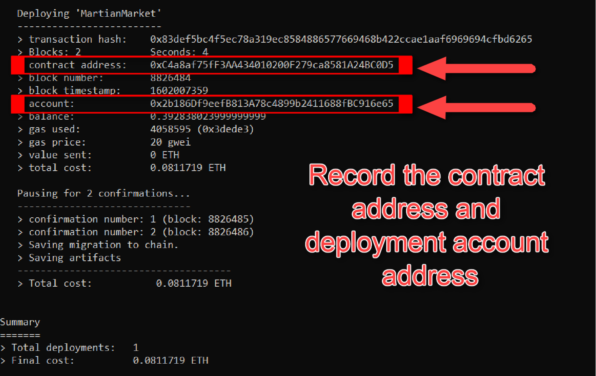
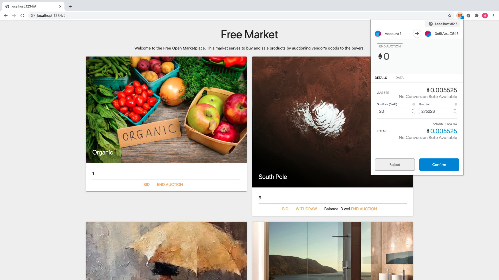
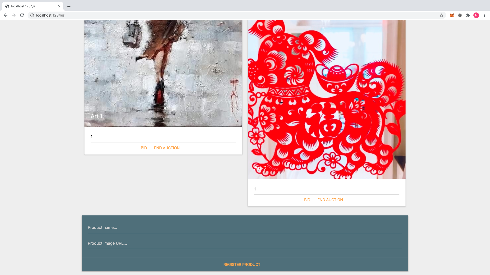

# Free Market on Ethereum Block Chain!

## Contributors

@weidongli20

## Technology Stack

- Solidity, JavaScript, HTML

## About


The system will be a combination of an ERC721 contract and an auction contract combined to form the FreeMarket contract.

The vendor will be able to register new products with their account, minting and creating a new auction for the product.

When the `endAuction` function is called, the auction will complete and the token will be transferred to the bidder (buyer).

The functions of the contract can be designed to have the buyer pay for the most expensive functions like`safeTransferFrom`.
This can be done by putting the token transfer in the `endAuction` function that only the vendor can call.

Each product sold will be a unique ERC721 token, with its own metadata including the product `name` and `image` URL.

## Demo App

Please use Google Chrome to open this page and Click [here](https://weidongli20.github.io/Free-market/) to launch the Free Market application

# Instructions

## Before you begin

1. An infura account and endpoint is necessary for this assignment. This will allow you to deploy directly to your chosen Testnet from the CLI. (Remix will not be used!)

2. Go to [infura.io](https://infura.io/) and sign up for an account.


3. Once you've signed up, create a project and record the end point:



## Setting up your project

1. Create a new Github repository named `Free_market` and clone it to your machine. 
2. From your terminal, `cd` into the directory, then run the following commands:

    * `npm install`
    * `npm install -g truffle`
    * `npm install @truffle/hdwallet-provider`
    * `npm install @openzeppelin/contracts`

4. These commands will install various dependencies that will allow for more streamlined deployment of your app.
5. Using a code editor such as VSCode, navigate to the `truffle-config.js` file and make the following changes:
    * On line 22, insert your mnemonic phrase.
    * On line 61, insert your infura endpoint.
    * Save the file. 

## Designing the contracts
---
### FreeAuction

The included `FreeAuction.sol` contract is a direct copy of the `SimpleAuction` contract from the
[Solidity documentation](https://solidity.readthedocs.io/en/v0.5.10/solidity-by-example.html?highlight=auction#id2).
You will need to modify this contract in the following ways:

- Remove the biddingTime functionality, ensuring the foundation can call end the auction any time

- Set `ended` as a `public` variable so the `FreeMarket` contract can access it with an automatic getter

- Change `msg.sender` in the `bid` function to a payable address parameter instead, to make it easier for the `FreeMarket`
  contract to call and to allow bidding on behalf of another address

- Add a `require` in `auctionEnd` that only allows the beneficiary to end the auction

### FreeMarket

This contract will store an array of FreeAuctions in a mapping of tokenIds to FreeAuctions.
When the auction ends, the token ownership will be transferred to the bidder (buyer) of the auction.

You will need to complete the functions provided in the starter code. Here are some tips for the main functions:

- In `endAuction`, you will need to end the auction, then perform a `safeTransferFrom`, transferring the token to the
  `auction.Bidder()` from the `owner()`

- In the bid function, you will need to pass the `msg.value` to the function call to pass the ether to the auction.
  You can do this by adding `value(msg.value)` immediately before the parameter.
  It will look something like `auction.bid.value(msg.value)(msg.sender);`

- The rest of the functions are mostly just exposing the internal `FreeAuction` functions by fetching the auction by
  tokenId and calling the functions from that instance. The `getAuction` function is very useful and should be completed
  early.

- Make sure to include `require(_exists(tokenId), "error message here")` when possible, and other `requires` that will prevent lost ether or enforce security.

## Deploying to a Testnet
---
1. After the contracts are properly implemented, use your terminal to run the command `truffle deploy` and pass your desired network using the `--network` flag like so:

    ```python
    truffle deploy --network ropsten
    ```
2. This will initiate a process of deployment.  It will take some time, so don't worry if it looks like things are stalling. You should see output to your screen similar to the following:

    

3. Once this process is complete, your contract will fully deployed on the Testnet of your choice.  

4. **Important!:** 
    * Record the contract address and the deployer address from the output for later use!

    

## Working with the frontend
---
### Modifying the frontend code

* Navigate to the file titled `dapp.js`.  

* At the very top of the file, insert your newly recordeded contract address. 

* This will ensure the frontend can communicate with the smart contract backend. 

### Testing the Market

* To test your dApp:
    
    * cd into `martian_market` and run `npm run dev`.

    * This command will launch the front end via a local server that will allow you test your app locally in your browser.

    * Once you run the command, you can type `localhost:1234` in your browser and the app should be visible and available for testing.

    * You should import at least 2 accounts into MetaMask for testing:
        * The deployer of the contracts (the one we notated in the deployment process) 
        * One other address of your choosing to test non-admin features.

* After launching with the above steps, you should see something like this:


* You should be able to bid on a token:


* When you are out-bid, you should be able to withdraw your pending balance in escrow:



* When you are using the foundation account in MetaMask, you should be able to end auctions as well. This will then transfer the token to the highest bidder of the auction. You will see this as such:


* You can also register new land using the foundation address:




## Github Deployment

With the contracts and front end fully functioning, you can now deploy to github pages for a live, interactive dApp experience to add to your portfolio!

1. Deploy to Github Pages by running the command `npm run deploy` in your terminal. This will run the provided convenience package `gh-pages` will automatically publish the bundle to the `Free_market` repo you initialized in the beginning of the homework. 

2.  After running `npm run deploy` continue the normal process of pushing to your remote repository.

## Submission

Ensure that you have changed the `contractAddress` in the frontend code to be the address deployed on a live network.

## Celebrate

You have just created a system that few people in the world have ever even imagined! Just imagine all of the things you
can build now. By building this, you have flexed every Solidity muscle you can. You have proved to the world and to yourself
that you can build next generation financial technology!

## Contact

#### Developer/FinTech Developer

- Name: wei (@weidongli20)
- e-mail: 4531holly@gmail.com
- Github: [https://github.com/weidongli20](https://github.com/weidongli20)
- LinkedIn: [https://www.linkedin.com/in/weidongli20/](http://www.linkedin.com/in/weidongli20)
